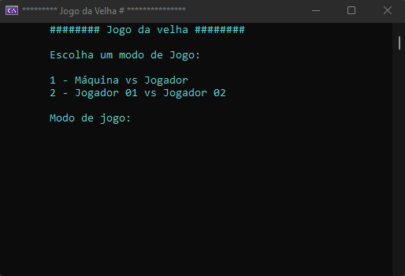

  

    
    <h1>🚀Academia .Net Atos UFN🚀</h1>
  

  <h2 align="center">🚀 Desafio Jogo da velha 🧑‍🎓</h2>
  

    
  

  

    ✅ Desenvolva um jogo da velha utilizando matrizes em C#. Faça com que cada
    jogador insira a sua jogada em uma interface amigavel. Teste se a posição é
    válida e caso não seja solicite ao jogador repetir a jogada. Após cada
    jogada, apresente o tabuleiro com as jogadas representadas por "X" e "O" e
    faça a verficação se algum jogador venceu. Caso seja empate, apresente o
    resultado na tela. Possilibilite que o jogo seja reinicializado sem a
    necessidade de reiniciar o jogo.
  

  

    ✅ Bonus: Faça a implementação de um jogo contra o computador. Faça o
    possível para evitar que o jogador vença do computador. Para facilitar, faça
    com que o computador inicie jogando.
  

  

    <a href="./Program.cs">solução</a>
  

